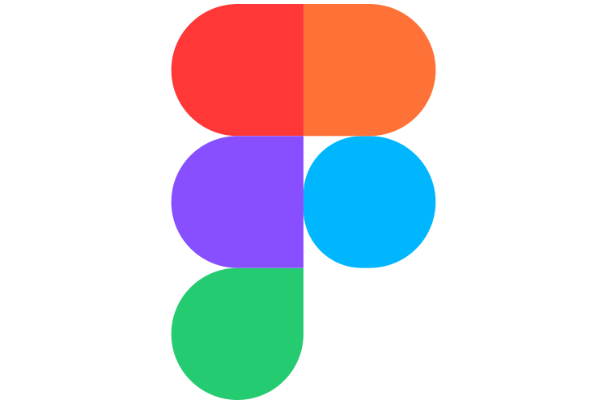

<div align="center">

# Brand Logo Variants

**Primary, Black, White & Outline brand logos for designers, developers and creators.**

Free, consistent brand logo variants in SVG format.

[](LICENSE)
[](CONTRIBUTING.md)
[](#)
[](https://github.com/freemiumassets/brand-logo-variants/stargazers)

[Preview](#preview) · [Browse Logos](#available-brands) · [Usage](#usage) · [Contribute](CONTRIBUTING.md) · [Full Logo Collection](https://freemiumassets.com)

</div>

---

## Why This Exists

Finding a brand logo is easy. Finding one that fits your layout is not.

A colored logo looks wrong on a dark footer. A white logo disappears on a light card. A full-color mark clashes with a minimal, monochrome design system. So you end up opening an editor, recoloring paths by hand, and hoping you did not distort anything.

**Brand Logo Variants** removes that step. Every brand is provided in four consistent SVG variants, ready to drop into your project.

## The Four Variants

| Variant | Best for | Typical use |
| :-- | :-- | :-- |
| **Primary** | Recognizable, on-brand presentation | Integration pages, partner sections, blog posts, product listings |
| **Black** | Light backgrounds | Docs, light-mode UIs, print, "Trusted by" sections |
| **White** | Dark backgrounds | Dark-mode UIs, footers, hero sections, video overlays |
| **Outline** | Minimal or decorative designs | Icon sets, line-art layouts, feature grids, illustrations |

**Primary** uses the brand's own colors, so it is the closest to the original mark. Black, White and Outline are monochrome, which keeps logo walls, integration pages and partner sections looking clean and cohesive. For brands whose mark is already a single color, Primary may match one of the monochrome variants.

## Preview
**Note:** White logos may appear invisible on GitHub's light theme. That's expected. They are designed for dark backgrounds.

| Brand | Primary | Black | White | Outline |
| :-- | :--: | :--: | :--: | :--: |
| Canva |  |  |  |  |
| Figma |  |  |  |  |
| GitHub |  |  |  |  |
## Repository Structure

```
logos/
├── canva/
│   ├── primary.svg
│   ├── black.svg
│   ├── white.svg
│   └── outline.svg
├── figma/
│   ├── primary.svg
│   ├── black.svg
│   ├── white.svg
│   └── outline.svg
```

Each brand lives in its own folder, named in lowercase with hyphens (for example `visual-studio-code`). Every file follows the same naming pattern, so paths are predictable and easy to script.

## Available Brands

<!-- AVAILABLE-BRANDS:START -->
| Brand | Primary | Black | White | Outline |
| :-- | :--: | :--: | :--: | :--: |
| Canva | [primary](logos/canva/primary.svg) | [black](logos/canva/black.svg) | [white](logos/canva/white.svg) | [outline](logos/canva/outline.svg) |
| Figma | [primary](logos/figma/primary.svg) | [black](logos/figma/black.svg) | [white](logos/figma/white.svg) | [outline](logos/figma/outline.svg) |
| GitHub | [primary](logos/github/primary.svg) | [black](logos/github/black.svg) | [white](logos/github/white.svg) | [outline](logos/github/outline.svg) |
<!-- AVAILABLE-BRANDS:END -->

The list grows through community contributions. Missing a brand? [Open a request](../../issues/new) or [add it yourself](CONTRIBUTING.md).

## Getting Started

### Clone the repository

```bash
git clone https://github.com/freemiumassets/brand-logo-variants.git
cd brand-logo-variants
```

### Download a single file

```bash
curl -O https://raw.githubusercontent.com/freemiumassets/brand-logo-variants/main/logos/github/primary.svg
```

## Usage

### Plain HTML

```html

```

### Light and dark mode with `<picture>`

Swap between the Black and White variants automatically based on the visitor's color scheme:

```html
<picture>
  <source media="(prefers-color-scheme: dark)" srcset="logos/github/white.svg">
  
</picture>
```

This also works in a GitHub README:

```markdown
<picture>
  <source media="(prefers-color-scheme: dark)" srcset="logos/figma/white.svg">
  
</picture>
```

### CSS background

```css
.icon-github {
  width: 200px;
  height: auto;
  background: url("logos/github/outline.svg") no-repeat center / contain;
}
```

### Inline SVG

Inline the file contents when you want to style it with CSS:

```html
<span class="logo">
  <!-- paste the contents of logos/github/black.svg here -->
</span>
```

```css
.logo svg {
  width: 200px;
  height: auto;
  fill: currentColor;
}
```

> Inline styling works best when the SVG uses `currentColor` or has no hard-coded fills. The Primary variant keeps the brand's own colors, so use Black, White or Outline when you need to recolor with CSS.

### React / Next.js

```jsx
import Image from "next/image";

export function BrandLogo({ brand, variant = "primary", size = 200 }) {
  return (
    <Image
      src={`/logos/${brand}/${variant}.svg`}
      alt={brand}
      width={size}
    />
  );
}

// <BrandLogo brand="github" variant="white" />
```

### Figma, Sketch and Adobe XD

Download the SVG and drag it onto your canvas. Every file is a clean vector, so you can scale and edit it freely.

## License and Trademark Disclaimer

The repository's own tooling, documentation and file organization are released under the MIT License.

**All logos, trademarks, brand names and brand identities are the property of their respective owners.** They are included here for identification and reference only. This project is not affiliated with, endorsed by, or sponsored by any of the brands listed.

The Primary, Black, White and Outline files are unofficial, simplified adaptations. If you use a logo, follow that brand's official guidelines, and check the brand's own guidelines or press kit before using its logo in commercial work, marketing or anything that could imply an official partnership.

If you are a rights holder and would like a logo corrected or removed, please [open an issue](../../issues/new) and it will be handled promptly.

## More Brand Logos

Want to browse without cloning a repository? The complete collection is also available on [FreemiumAssets](https://freemiumassets.com), where you can preview logos and download the variants you need.

---

<div align="center">

If this project saves you time, consider giving it a ⭐

</div>
